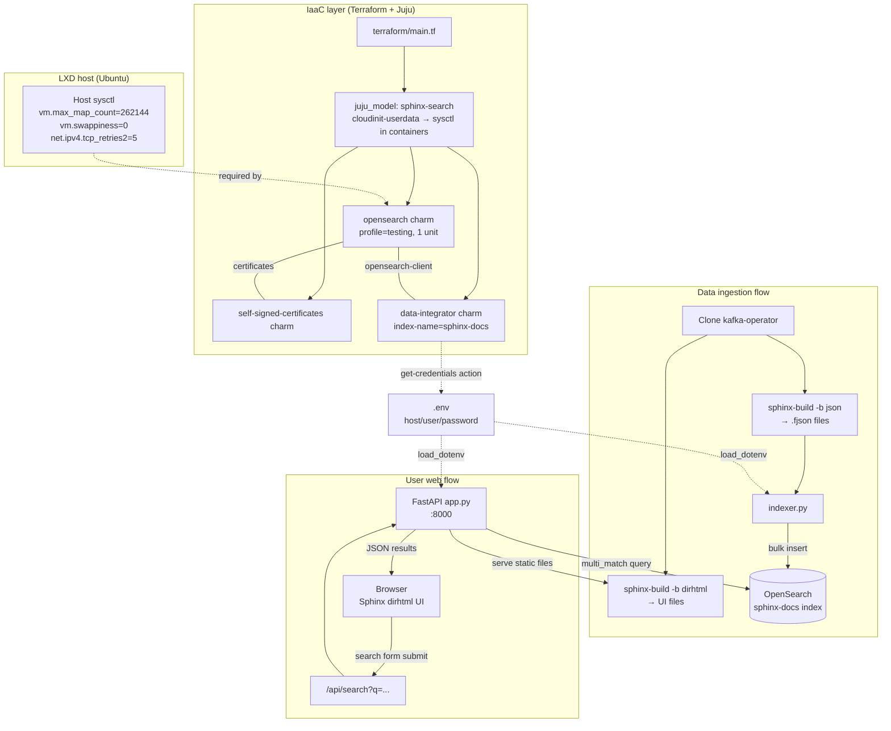

# Architecture

## Flow summary

1. **IaaC** — `bootstrap-env.sh` tunes the host and bootstraps LXD + Juju; `terraform apply` deploys OpenSearch, self-signed-certificates, and data-integrator, then `fetch-credentials.sh` extracts credentials to `.env`.
2. **Ingestion** — `build-docs.sh` clones the Kafka Operator docs, builds them in JSON and dirhtml formats, and `indexer.py` bulk-loads the `.fjson` content into the `sphinx-docs` OpenSearch index.
3. **Web** — `app.py` (FastAPI) serves the dirhtml build at `/` and exposes `/api/search`, which queries OpenSearch with a `multi_match` on `title^3, body`. The injected `custom_search.js` intercepts the sidebar search form and renders results as `.opensearch-result-item` nodes.

## Security boundary

OpenSearch credentials live only in `.env` on the host and are loaded by
`indexer.py` and `app.py`. They never appear in the browser — the FastAPI
proxy is the sole client of OpenSearch, which is the core design goal of the
PoC.
